# MyView
一些杂七杂八的自定义控件。

### 自动弹的球
在屏幕里自动弹，碰到墙壁了改变颜色的球。

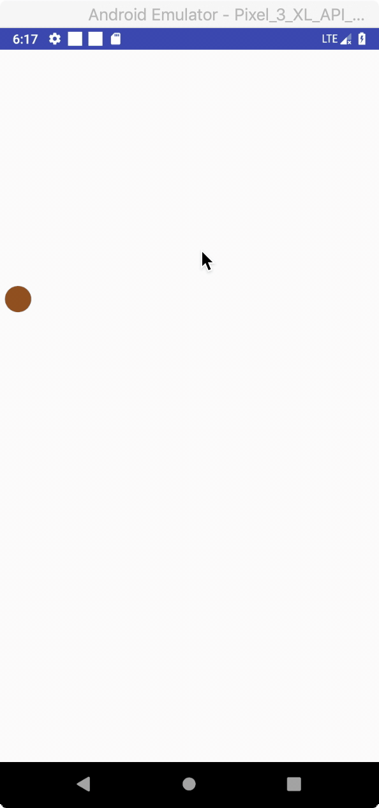

### 钟表
会自己走的钟表。

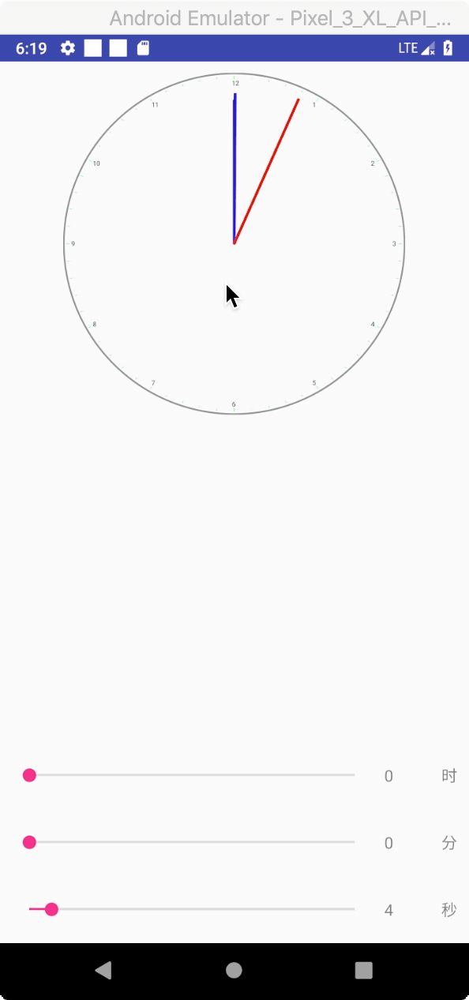

### 验证码
验证码样式

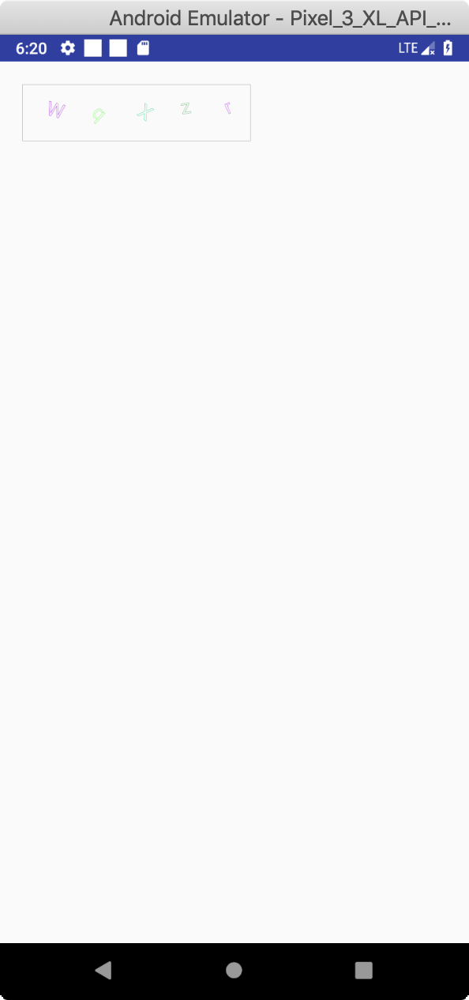

### 侧滑
自己实现的简单侧滑效果

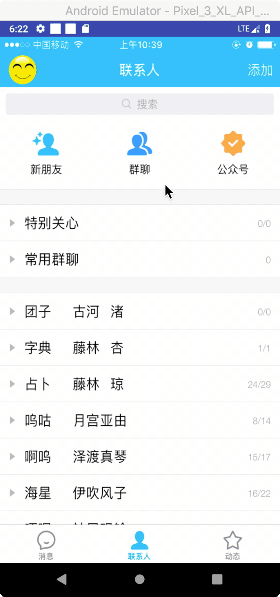

### 动画
展开关闭的简单动画

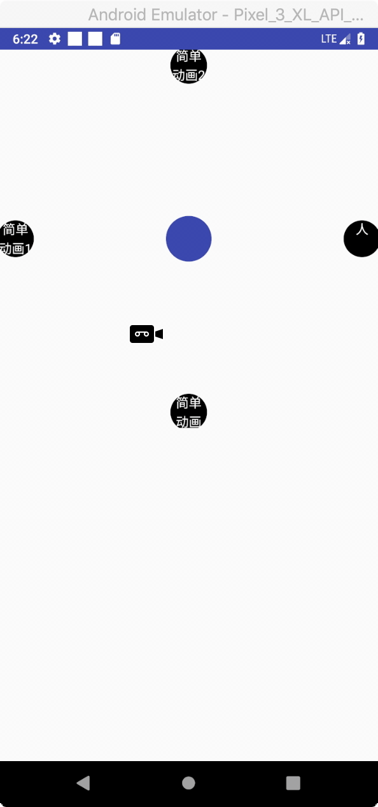

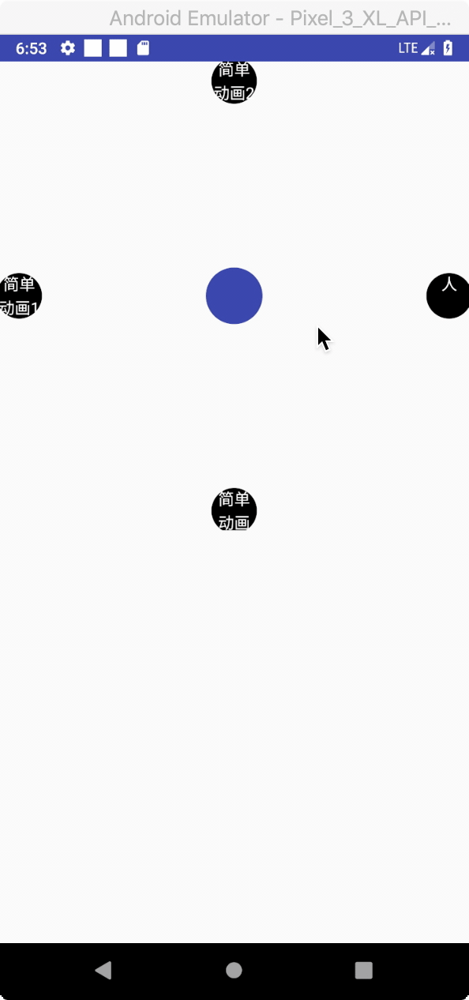

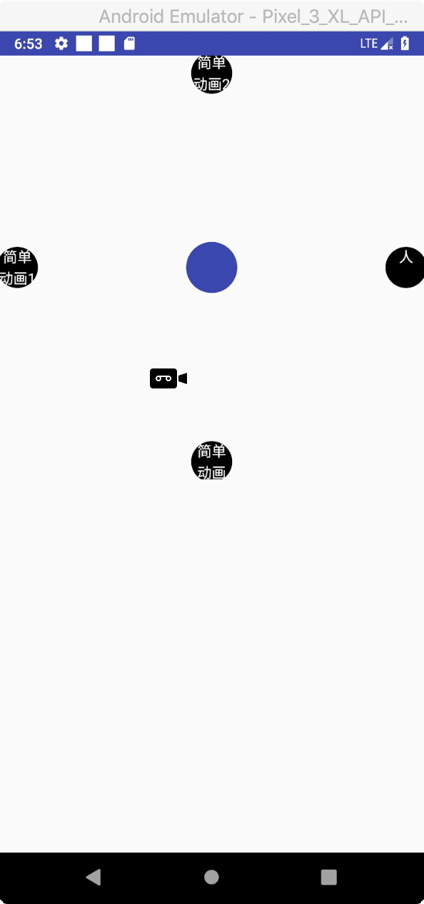

### 摩天轮
极简单的摩天轮效果

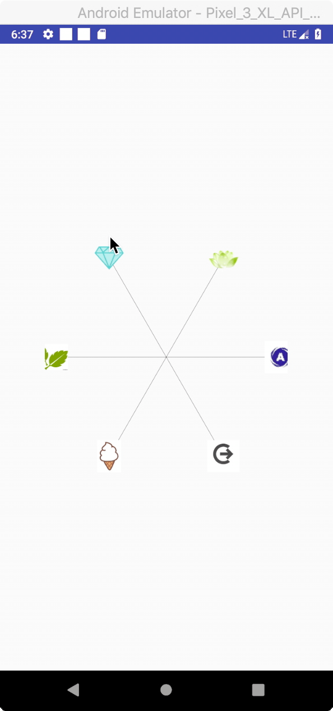

### 贝塞尔曲线
手写的贝塞尔曲线的实现，未用官方api

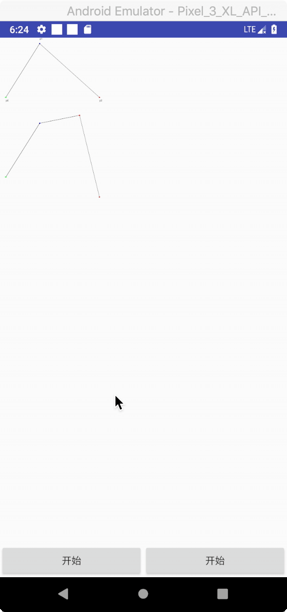

### 支付密码
弹窗输入支付密码样式

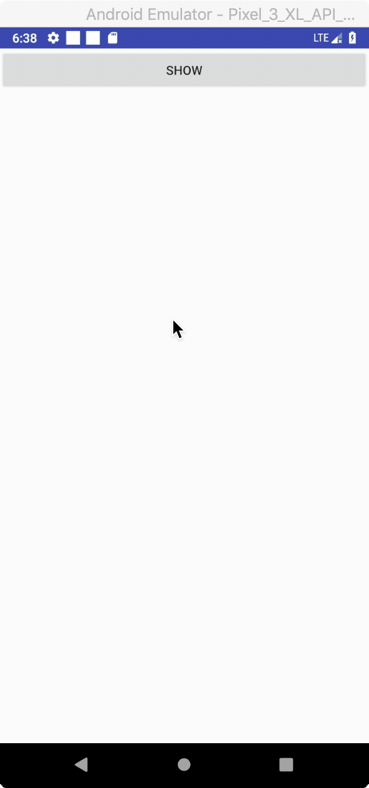

### 图片
通过颜色矩阵来修改图片的rgba

颜色识别小游戏

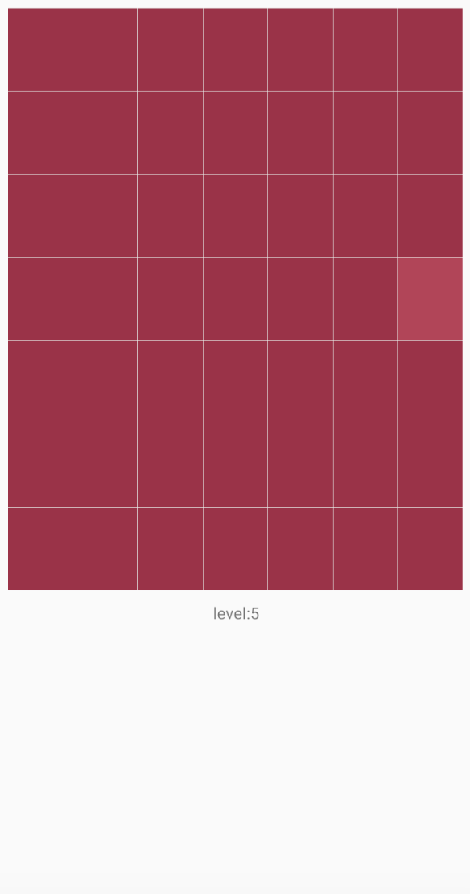

### 折线图
暂时未实现

### 星星
画星星

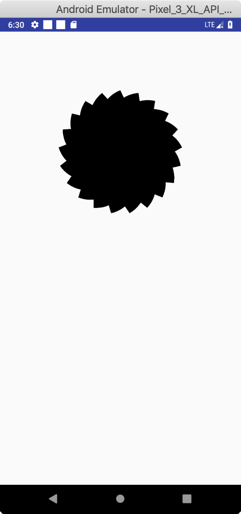

###列表
随列表移动的飞机

[有趣的ui效果——随列表移动的小飞机](https://blog.csdn.net/u014068277/article/details/105473427)